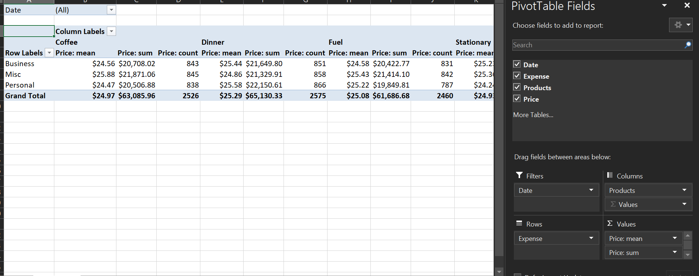

# GuruBlog-PivotTablesPythonExcel
This project was created as a part of Blog Post, which walks through "How to generate Excel Pivot Tables using Python". For this, we use [pywin32 library](https://pypi.org/project/pywin32/). The Project has three folders:
<ol>
  <li>Codes: Contains the Jupyter Notebook which can be used to replicate the results</li>
  <li>Files: Contains the excel file output of the code.</li>
  <li>Images: Contains a screenshot of the Pivot Table</li>
  </ol>
  
### Process:
The keys steps are:
<ol>
  <li>Function to generate dummy data: Can be ignored if you already have the data</li>
  <li>Function to create a pivot table: Donot make any changes in this function</li>
  <li>Function to Create excel file and call Pivot table function: Make required changes in this function </li>
  <li>Main Function: Make required changes here</li>
</ol>

The output of the code, is a pivot table as shown below:

